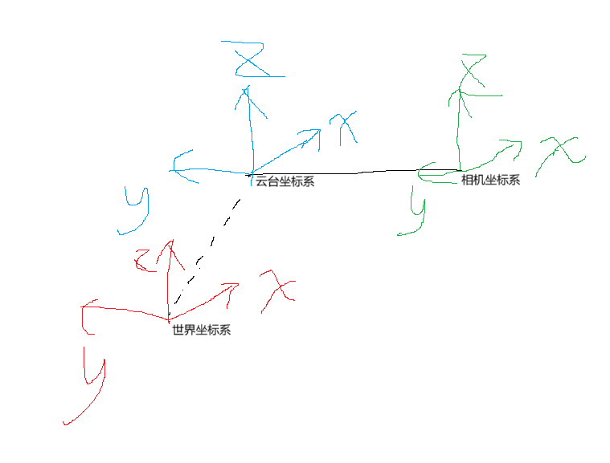

# 坐标系变换

## 🧭 功能

实现坐标系转换：

```text
相机光心坐标系Photocenter → 相机坐标系Camera → 云台坐标系Gimbal → 世界坐标系Odom
```

用于将 PnP 解算结果转换到世界坐标系。

---

## 📐 坐标系约定（右手系）
相机坐标系Camera 云台坐标系Gimbal 世界坐标系Odom
```text
X → 前
Y → 左
Z → 上
```
相机光心坐标系Photocenter
···text
X → 右
Y → 下
Z → 前
---

## 🔁 变换流程

```text
P_camera = R_camera_photocenter * P_photocenter
P_gimbal = R_gimbal_camera * P_camera + t_gimbal
P_odom   = R_odom_gimbal * P_gimbal + t_odom
```

---

## 📥 输入

* `tvec`：PnP 平移向量
* `rvec`：PnP 旋转向量
* `cam2gimDis`：相机→云台距离
* `gim2odom_angle`：云台→世界倾角
* `gim2odomDis`：云台→世界距离
* `gimbal_pitch / yaw`：云台姿态
* `roll`：车体横滚（默认0）

---

## 📤 输出

* `odom_tvec`：世界坐标位置
* `odom_rvec`：世界坐标姿态

---

## 🚀 示例

```cpp
    float cam2gimDis = 1;
    float gim2odom_angle = 0.7853;
    float gim2odomDis = 1.414;
    float gimbal_pitch = 0;
    float gimbal_yaw = 0;
    float roll = 0;

    tvec.at<double>(0,0) = 0;
    tvec.at<double>(1,0) = -1;
    tvec.at<double>(2,0) = 1;
    rvec.at<double>(0,0) = 0.7854;
    rvec.at<double>(1,0) = 0;
    rvec.at<double>(2,0) = 0;

    TransForm::coordinateTransform(
        tvec,
        rvec,
        cam2gimDis, 
        gim2odom_angle, 
        gim2odomDis, 
        gimbal_pitch, 
        gimbal_yaw,
        odom_tvec,
        odom_rvec,
        roll
    );
```


---

## 📦 依赖

* OpenCV
* OpenCV viz
* Eigen